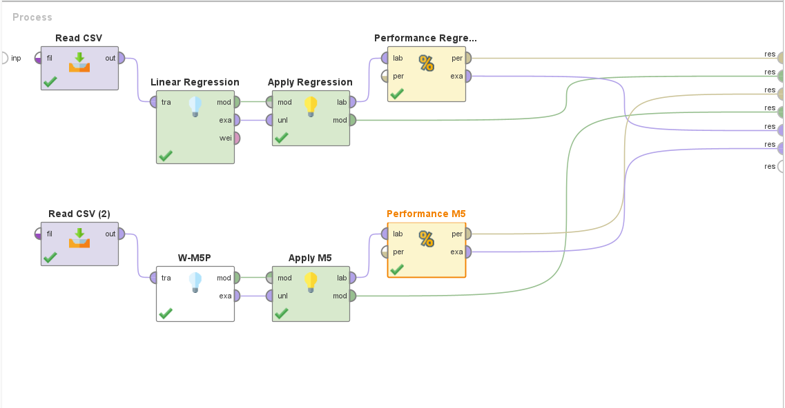
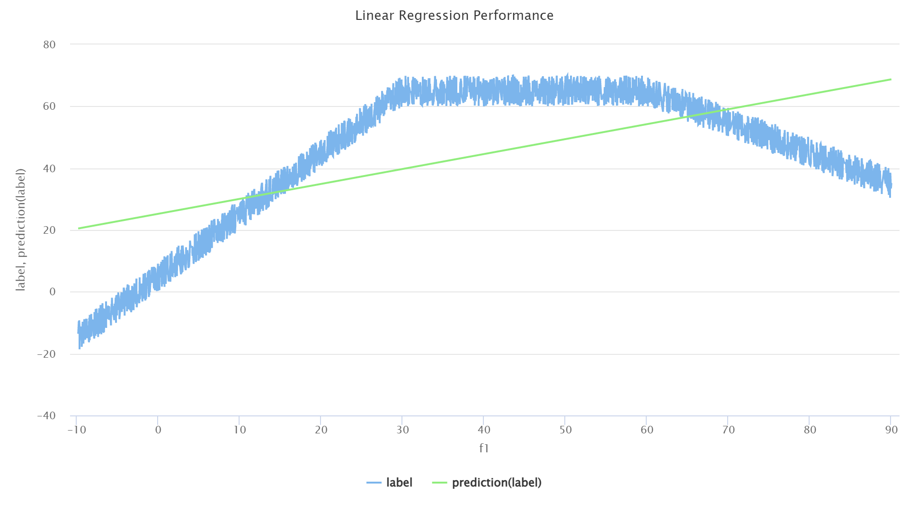
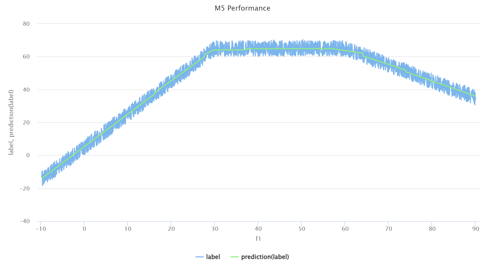
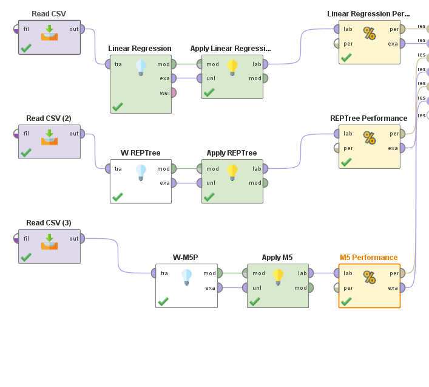
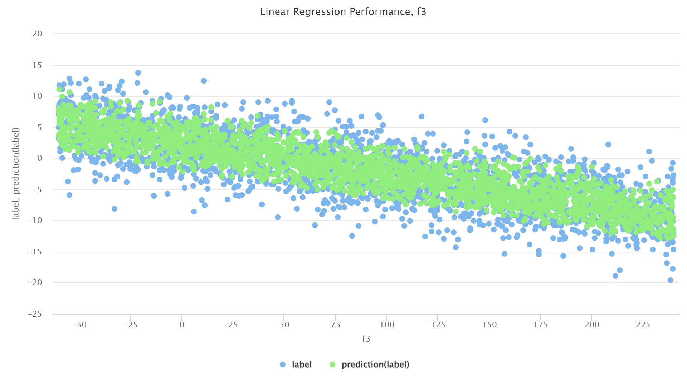
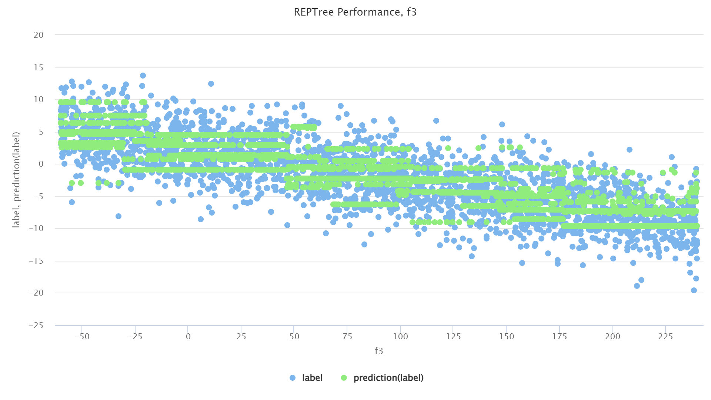
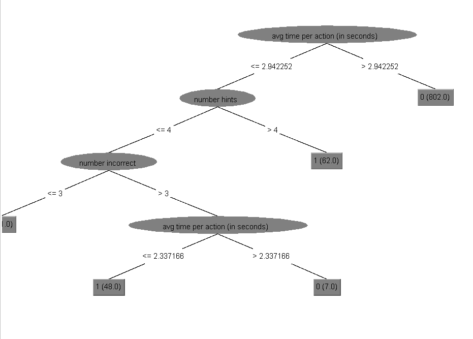
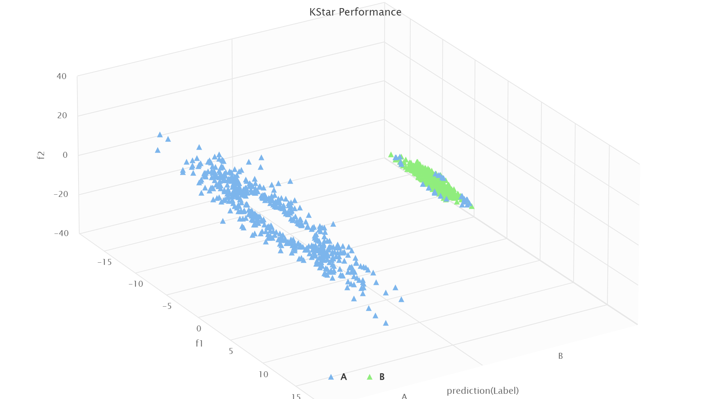
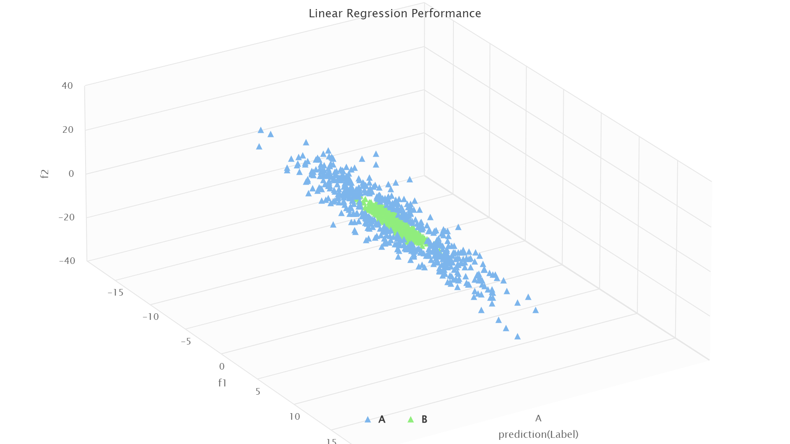

# Hands-on-data #3

The goal of this assignment is for you to familiarize yourself with different predictive modeling algorithms and with tools that allows you to build predictive models. You will be asked to build regression and classification models using specific algorithms on predefined datasets. You will be asked to reflect on why specific algorithms worked better on specific datasets.

When submitting the assignment, include a text document answering the questions as well as RapidMiner process files (save your process as .rmp).

## Contents

- [Hands-on-data #3](#hands-on-data-3)
  - [Contents](#contents)
  - [Regressions](#regressions)
    - [Question 1.1 (0.5 point)](#question-11-05-point)
    - [Question 1.2 (0.5 point)](#question-12-05-point)
    - [Question 1.3 (0.5 point)](#question-13-05-point)
    - [Question 1.4 (0.5 point)](#question-14-05-point)
  - [Classifications](#classifications)
    - [Question 2.1 (0.5 point)](#question-21-05-point)
    - [Question 2.2 (1 point)](#question-22-1-point)
    - [Question 2.3 (0.5 point)](#question-23-05-point)
    - [Question 2.4 (0.5 point)](#question-24-05-point)

## Regressions

### Question 1.1 (0.5 point)

Using the dataset named [Assignment3-Q1.csv](./data/Assignment3-Q1.csv), create regression models predicting the value of “label” using the following algorithms and report correlations for each of the models:

- Linear Regression (“Linear Regression” operator in RapidMiner)

> `0.608`

- M5’ (“W-M5P” operator in RapidMiner)

> `0.992`

> Models:
> 

### Question 1.2 (0.5 point)

Which algorithm achieved the highest performance on question 1? Why was that algorithm more successful? Use a visual representation of the data to support your statement.

> The M5 algorithm reached the highest performance.
> As we can observe in the following graphs, the actual label doesn't follow a single line. It increases, reaches a plateau, and then it decreases.
> The Linear Regression model was unable to capture such nuances, and only predicted the labels along a strictly increasing straight line.
> 
>
> 

### Question 1.3 (0.5 point)

Using the dataset named [Assignment3-Q3.csv](./data/Assignment3-Q3.csv), create regression models predicting the value of “label” using the following algorithms and report correlations for each of the models:

- Linear Regression (“Linear Regression” operator in RapidMiner)

> 0.865

- REPTree (“W-REPTree” operator in RapidMiner)

> 0.867

- M5’ (“W-M5P” operator in RapidMiner)

> 0.865

> Models:
> 

### Question 1.4 (0.5 point)

Using the models created in Question 3, compare the effectiveness and the content of each model.

Which model has the highest performance?

> REPTree

Compare the Linear Regression and the M5’ models. What are the differences and/or similarities between those two models?

> _M5_ only found one branch for the tree. Its label classification is:
> $$LM_1=1.5045f_1 + 0.001f_2 - 0.0497f_3 + 0.095$$
> The _Linear Regression_ formula is:
> $$LR=1.505f_1 + 0.001f_2 - 0.050f_3 + 0.095$$
> They arrived at very similar results.
> They seem to disagree slightly on $f_1$ and $f_3$

What can you conclude about the usefulness of the M5’ algorithm for this dataset? What information does that provide us about the nature of the relationship between the features and the label?

> Because _M5_ was able to score a fairly decent correlation with a single branch and that the equation it found is very similar to the one discovered by the _Linear Regression_ algorithm, we can deduce that the relationship between the features and the label is linear.

Compare the Linear Regression model and the REPTree model. Which one as the highest performance? Which one seems like a more accurate representation of the relationship between the features and the label? Why?

> Although _REPTree_ manage to score a marginally higher correlation ($0.002$ higher), _Linear Regression_ seems to more cosely describe the relationship between the features and the label.
>
> We can easily observe this in the graphs for these algorithms.
>
> 
>
> 

## Classifications

### Question 2.1 (0.5 point)

Using the dataset named [Assignment3-Q5.csv](./data/Assignment3-Q5.csv), create classification models predicting the value of “is gaming?” using the following algorithms and report accuracies for each of the models:

- Step Regression (“Linear Regression” operator in RapidMiner)

> 89.20%

- J48 decision tree (“W-J48” operator in RapidMiner)

> 100.00%

### Question 2.2 (1 point)

Using the results from Q1, answer the following questions:

Which of the two algorithms achieved the highest accuracy? Explain why you think this model was more effective. Discuss how different features (or combination of features) are related to the label and how those relationship can or cannot be captured by the algorithms

> _J48_ has a higher accuracy. That is because it can better capture the influence of each feature on the label.
>
> _J48_ also produces some intuitive branches in its model. For instance, students that take longer to answer a question are less likely to be gaming. Number of hints taken also has an influence: students who take a short time and ask for many hints (over 4 hints) are labeled as having gaming behavior.
>
> However, as we look deeper into the structure of the tree, we see what I would indicate as a sign of the model being overfitted into the data. A student who performs an average of actions per second between 2.3 and 2.9, asks for less than 4 hints and has over 3 incorrect solutions is labeled as not gaming. Forthermore, note that the model found only 7 students who fit into that path of the tree.
>
> 

Even though the accuracy of both model is fairly high, the two models have very different actual performance. Look at the confusion matrix: the table indicating the number of correct and incorrect predictions produced by RapidMiner’s performance operator. Accuracy is computed by looking at the number of true positives (instances of gaming detected as gaming) and true negatives (instances of not-gaming detected as not-gaming) and dividing by the total number of instances; (TP + TN) / total. Try to explain why accuracy might not be the best measure of performance in this dataset.

> Accuracy is not a good measurement of performance in this case because there are relatively few _True Positives_ (`true 1` on the table), meaning we have very few datapoints where students actually exhibited gaming behavior. Therefore, an algorithm that always (or almost always) predicts a negative (`0`, i.e. student _isn't_ gaming).
>
> Such is the case with the _Linear Regression_ algorithm: it only predicted 2 positives, and had 108 false negative predictions. We can observe that, using a strategy of almost always predicting 0, it managed to have a high accuracy, even though it only correctly predicted 1.82% of gaming behavior correctly (true positives).
>
> In the context where detecting positives (gaming behavior) is the goal, accuracy is not a good measure of performance as it fails to capture the model's failure in actually labeling gaming behavior correctly.

### Question 2.3 (0.5 point)

Using the dataset named [Assignment3-Q7.csv](./data/Assignment3-Q7.csv), create classification models predicting the value of “label” using the following algorithms and report accuracies for each of the models:

- Step Regression (“Linear Regression” operator in RapidMiner)

> 53.85%

- K\* (“W-KStar” operator in RapidMiner)

> 97.28%

### Question 2.4 (0.5 point)

Which algorithm achieved the highest performance on Question 3? Why was that algorithm more successful? Use a visual representation of the data to support your statement. (Hint: try coloring each data point using a unique color for each label)

> _KStar_ performs better. _Linear Regression_ exclusively predicted label A.
>
> In the following plots, we separate data points using their predicted label, and color them using their actual label. We can observe how _KStar_ predicted a false B label a few times, but managed to perform extremely well when compared to the _Linear Regression_ model.
>
> 
>
> 
