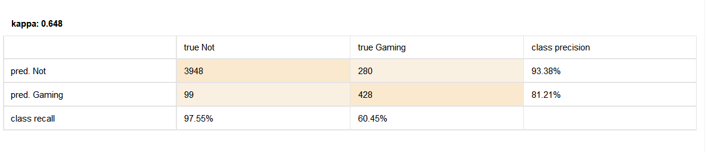
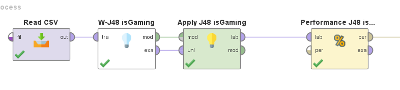
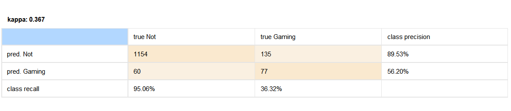
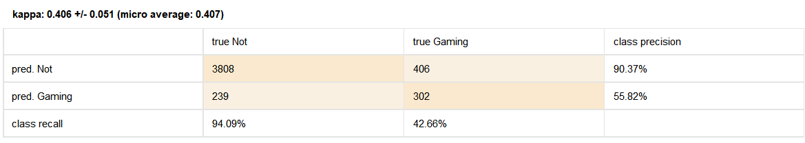

# Hands-on-data #4

The goal of this assignment is for you to familiarize yourself with different validation approaches designed to minimize over-fitting and with automated feature selection approaches. It is suggested that you complete the assignment using RapidMiner, but you are free to use a different equivalent tool if you desire.

When submitting the assignment, include a text document answering the questions as well as RapidMiner process files (or files associated to the tool you used to create the models) for each question.

## Validation of models

### Q1 – (0.5 point)

Using the dataset named [gaming.csv](./data/gaming.csv), create a classification model predicting the value of “isGaming” using the J48 algorithm. Report the model’s kappa.

> Kappa 0.648
> 
> 
> 
> 

### Q2 – (0.5 point)

Evaluate the performance of this model under split-validation (Split Validation operator in RapidMiner). Use 70% of the data set as the training data and 30% as the test data. Use stratified sampling. Report the kappa metric.

> Kappa 0.367
>
> 

### Q3 – (0.5 point)

Evaluate the performance of this model under 10-fold cross-validation (Cross Validation operator in RapidMiner). Use stratified sampling. Report the kappa metric.

> Kappa 0.406 +/- 0.051 (micro average: 0.407)
> 
> 

### Q4 – (0.5 point)

Using the dataset named [gaming-student-cross-validation.csv](./data/gaming-student-cross-validation.csv), evaluate the performance of this model under leave-one-out student-level cross-validation (Cross Validation operator in RapidMiner). Report the kappa metric.

> Kappa 0.402
> ![[q4_kappa.png]]
## Feature selection

### Q5 – (0.5 point)

Using the dataset named [gaming.csv](./data/gaming.csv), use a forward selection approach to create a classification model predicting the value of “isGaming” using the J48 algorithm. Report the model’s kappa.

> Kappa 0.635
> 
> ![[q5_kappa.png]]
### Q6 – (0.5 point)

Using the dataset named [gaming.csv](./data/gaming.csv), use a backward elimination approach to create a classification model predicting the value of “isGaming” using the J48 algorithm. Report the model’s kappa.

> Kappa 0.703
> 
> ![[q6_kappa.png]]
## Cognitive Tutor Algebra gaming model

### Q7 – (2 points)

You will use the features created by the students in the previous semester for Hands-on-data #1 (included in the file [CognitiveTutorAlgebra-gaming-resampled.csv](./data/CognitiveTutorAlgebra-gaming-resampled.csv)). Using the features, attempt to build the best possible model predicting whether students are gaming the system or not. Use different modeling algorithms, attempt different feature selection approaches. Feel free to create new features that can be included in your data file or to use the features you created in Hands-on-data #1. The file named [CognitiveTutorAlgebra-action-logs-with-gaming-clips.xlsx](./data/CognitiveTutorAlgebra-action-logs-with-gaming-clips.xlsx) can be used to compute additional features. Since the final file ([CognitiveTutorAlgebra-gaming-resampled.csv](./data/CognitiveTutorAlgebra-gaming-resampled.csv)) has been resampled, make sure to only use the same clips as the ones included in the csv file. The model should be cross validated using the “batch” variable included in the csv file. Provide a text explaining the different attempts that you made at building the “best” model. For example, provide information about which algorithms were used or which feature selection approaches were attempted. Provide performance metrics for each of those attempts.

*Bonus point: The model with best performance (using the Kappa metric) will be awarded 1 bonus point for the assignment. The model with the second-best performance will be awarded 0.5 bonus point.*

> All of the following have been evaluated using cross-validation split on the batch attribute.
> ### Linear Regression
> I applied forward selection on Linear Regression with the following parameters:
> 
> ![[Pasted image 20231008133813.png]]
> 
> The weights suggested I remove the 4 features with 0 weight (shown in the following graph)
> ![[Pasted image 20231008133902.png]]
> 
> Training using M5 yielded the following Kappa:
> ![[Pasted image 20231008134307.png]]
> 
> Greedy gave slightly better results
> ![[Pasted image 20231008134328.png]]
> 
> ### Random Tree
> 
> These were the attributes selected using the same method previously described but applied to the Random Tree algorithm:
> ![[Pasted image 20231008142622.png]]
> These were the results using only the selected features:
> ![[Pasted image 20231008143305.png]]
> These were the results using all features:
> ![[Pasted image 20231008143335.png]]
> ### REPTree
> 
> ![[Pasted image 20231008143803.png]]
> With or without the attribute selection, REPTree did extremelly poorly (less than .1 kappa)
> 
> ### J48
> ![[Pasted image 20231008145015.png]]
> Performance after filtering features:
> ![[Pasted image 20231008164311.png]]
> 
> ### Best Performing Algorithm
> 
> Because Greedy Linear Regression was the most promising algorithm I could find, I decided to take another look at it in case I could make any improvements to its performance.
> 
> After taking a look at the model, I noticed I had not filtered the gaming clip and the batch attributes. After removing them, the model's kappa increased to 0.195:
> ![[Pasted image 20231008170004.png]]
> 