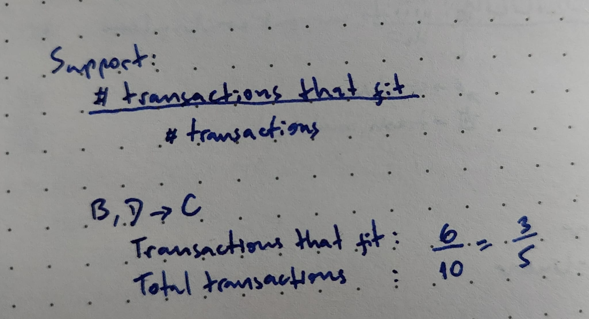
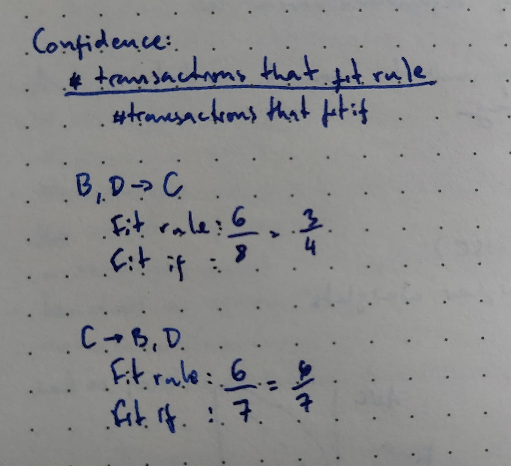
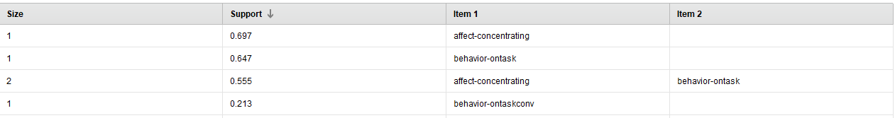
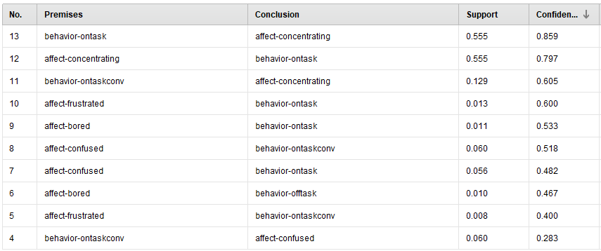

# Hands-on-data #6-1

The goal of this assignment is for you to familiarize yourself with association rule mining. You will be working with data inside and outside of RapidMiner.

When submitting the assignment, include a text document answering the questions as well as RapidMiner process files (or files associated to the tool you used to create the models) for each question.

##Association rule mining

To answer Q1 and Q2, use the following list of transactions:
ID Transaction
1 b, c, d, f
2 d, e
3 a, b, c, d, e
4 c, e
5 b, d, e
6 b, c, d, f
7 b, d, e, f
8 b c, d, e, f
9 a, b, c, d
10 b, c, d, e

### Q1 – (1 point)

Create a table representing the list of all transactions in which each possible elements of the transactions (a, b, c, d, e, f) are in their own column. The value of the cells for each of those columns should be 0 if the transaction doesn’t contain this element and 1 if the transaction contains this element. (see example from Week 9 association rule mining PowerPoint slides)

| ID  | a   | b   | c   | d   | e   | f   |
| --- | --- | --- | --- | --- | --- | --- |
| 1   | 0   | 1   | 1   | 1   | 0   | 1   |
| 2   | 0   | 0   | 0   | 1   | 1   | 0   |
| 3   | 1   | 1   | 1   | 1   | 1   | 0   |
| 4   | 0   | 0   | 1   | 0   | 1   | 0   |
| 5   | 0   | 1   | 0   | 1   | 1   | 0   |
| 6   | 0   | 1   | 1   | 1   | 0   | 1   |
| 7   | 0   | 1   | 0   | 1   | 1   | 1   |
| 8   | 0   | 1   | 1   | 1   | 1   | 1   |
| 9   | 1   | 1   | 1   | 1   | 0   | 0   |
| 10  | 0   | 1   | 1   | 1   | 1   | 0   |

### Q2 – (1 point)

Compute the following metrics for the association rules “b, d → c” and “c → b, d”:

> Support
> 
> Confidence
> 

Provide intermediate traces of your computations.

### Q3 – (1 point)

Use RapidMiner to generate association rules from the data set named [Association-rule-mining.csv](./data/Association-rule-mining.csv). To generate frequent item sets, use the FP-Growth operator with a minimum support of 0.001. Set the minimum number of item sets to 0. Use the “Create Association Rules” operator to generate association rules with a minimum confidence of 0.150 from this set of frequent item sets. Report both the list of frequent item sets provided by RapidMiner and the list of association rules with a confidence above 0.150. For each frequent item sets, report its support. For each association rule, report its confidence.

