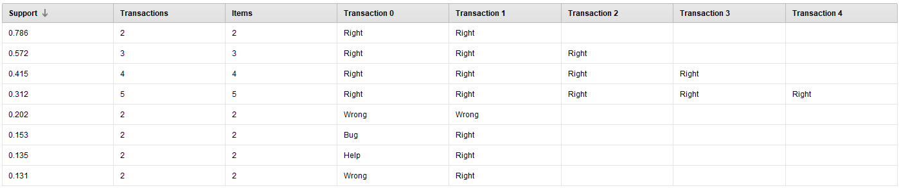
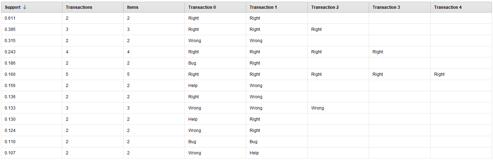

# Hands-on-data #6-2

The goal of this assignment is for you to familiarize yourself with sequential pattern mining. You will be working with data inside and outside of RapidMiner.

When submitting the assignment, include a text document answering the questions as well as RapidMiner process files (or files associated to the tool you used to create the models) for each question.

## Sequential pattern mining

### Q5 – (2 point)

Use RapidMiner to generate sequential pattern from the data sets named [CognitiveTutorAlgebra-GamingClips.csv](./data/CognitiveTutorAlgebraSequences-GamingClips.csv) and [CognitiveTutorAlgebra-NotGamingClips.csv](./data/CognitiveTutorAlgebraSequences-NotGamingClips.csv).

Use the “`Generalized Sequential Patterns`” operator to generate a list of frequent sequences within each data sets. Use “`clip ID`” as an indicator of which row is associated to which sequence. Use “action #” as the time attribute. Use a window size of 0, a max gap of 1 and a min gap of 1. Use 0.100 as the minimum support threshold to select a pattern.

Both data sets are taken from the 5 actions clips from Cognitive Tutor Algebra that we have been working with since the beginning of the semester. One of the data set, [CognitiveTutorAlgebra-GamingClips.csv](./data/CognitiveTutorAlgebraSequences-GamingClips.csv) contained only clips that were labeled as examples of students who are gaming the system and the other, [CognitiveTutorAlgebra-NotGamingClips.csv](./data/CognitiveTutorAlgebraSequences-NotGamingClips.csv), contains only clips that were labeled as students who were not gaming the system.

Look at the sequential pattern that were selected for each data set. What differences or similarities do you see? Look at the type of actions selected in each pattern, is there a difference that you can observe between the 2 data sets? For identical patterns, compare their support. What do you observe?

#### Answer

NotGaming sequential patterns table:

Gaming sequential patterns table:

Both tables are sorted by support.

We can observe that both NotGaming and Gaming datasets present these `Right` chains, where, presumably, students correctly answer problems in sequence.

The supports for corresponding chains differ between the `Gaming` and `NotGaming` datasets. While the highest support (for $\text{Right} \rightarrow \text{Right}$) in the `Gaming` data is $0.786$, the highest support in the `NotGaming` data is $0.611$ (also for $\text{Right} \rightarrow \text{Right}$)

The next 3 highest support sequences for `NotGaming` are also `Right` chains. However, the second highest sequence only has a support of $.385$.

Overall, it seems that gaming does not pay off, as we can observe `NotGaming` students consistently have `Right` chains with much higher support then `Gaming` students. Another indicator of this is the $\text{Wrong} \rightarrow \text{Wrong}$ sequence: `NotGaming`'s such sequence has a support of $0.202$, while `Gaming`'s has a support of $0.315$.
